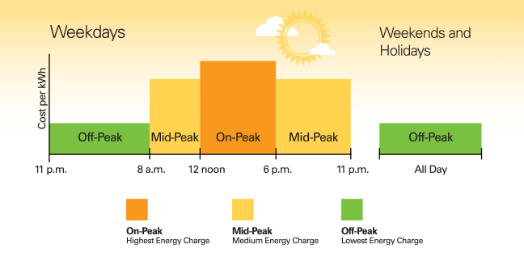
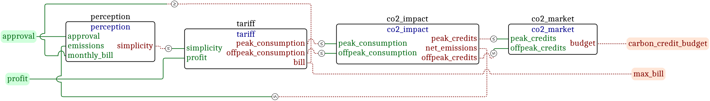
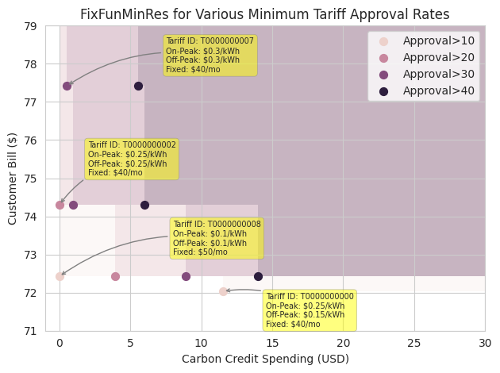

# Co-Design of Electricity Rates

**Daniel Shen**

**1.144: Applied Category Theory for Engineering Design**

# Introduction

Electricity rates (tariffs) for customers are set by utilities to charge customers for the holistic cost of providing electricity. Tariff designs should be “fair” — a judgment which involves multiple, possible competing, objectives. Bonbright’s 1988 work *Principles of Public Utility Rates* outlines ten principles for a “desirable rate structure”:

* Effectiveness at yielding total revenue requirements under the fair return standard.
* Revenue stability and predictability, with a minimum of unexpected changes seriously adverse to utility companies.
* Rate stability and predictability, with a minimum of unexpected changes seriously adverse to ratepayers.
* Discouraging wasteful use of services while promoting all justified types and amounts of use.
* Reflection of all present and future private and social costs and benefits due to a service’s provision.
* Fairness of apportionment of total costs of service between rate classes.
* Avoidance of undue discrimination in rates.
* Dynamic efficiency promoting innovation and responding economically to changing demand and supply patterns.
* Practicality (simplicity, certainty, convenience of payment, economy in collection, understandability, public acceptability, feasibility of application).
* Freedom from controversies of interpretation.

These principles are sometimes competing. For example, the most economically efficient way to fairly appropriation system costs amongst different customers might be to design a personalized rate for each individual customer that reflects their real-time network usage. However, such a design would not be practical for the utility to administer and it could risk yielding insufficient revenues to cover the utility’s total costs.

Given this wealth of potential tradeoffs between rate designs, this project seeks to explore how co-design can provide a framework for evaluating the “best” rate structure.

# Rate Components

Residential electricity rates commonly feature two components: a fixed charge which is applied regardless of usage and a volumetric charge which is billed per amount (volume) of electricity consumed. Volumetric charges disincentivize total consumption due to demand elasticity.

The volumetric price can be constant, or, if the metering infrastructure permits, can be time-varying. The latter setup is referred to as a time of use (TOU) rate and consists of pre-determined blocks of times and electricity prices during the day. An example of a TOU structure is shown below:

(from https://www.greenconvergence.com/blog/what-is-time-of-use)

Time of use rates incentivize more efficient consumption, since the price
during each block can more closely reflect the wholesale marginal cost of
generating power at that time. However, customers can be more hesitant to
accept a TOU rate structure since it is more complex than a flat rate.

# Problem Setup

For this project setup, we consider the functionalities of utility profit and
customer approval provided by a rate structure applied to a single customer
class. Overall customer approval is based on the total customer bill, the
carbon emissions of the utility, and the perceived *simplicity* of the rate.
Rates which consist of solely a fixed charge are considered to be the most
simple whereas “peakier” time of use structures with large differences between
the on- and off-peak price are perceived as less simple.

The resources of the design problem are the maximum customer bill and a carbon
credit budget which the utility can spend to reduce CO2 grid emissions and
increase the customers’ approval of the rate.

Consumption is considered over two periods of the day. Wholesale electricity
prices are more expensive during the on-peak period compared to the off-peak
period and the utility must pay more to serve electricity demand during the
on-peak period.

## Modules

The diagram of the MCDP is shown below:

## Customer Model

The customer’s demand elasticity in the on- and off-peak period is set based on
an exogenous demand curve. The impact of each tariff on customer consumption is
calculated in Python and input into the MCDP software as a catalog. See Jupyter
notebook `tariff-generator-v2.ipynb` for the code used to calculate customer
demand and generate the tariff catalog.

# Results

### Design Space

We consider three parameters of the rate:

- Fixed charges varying from $0/mo to $100/mo in increments of $10/mo.
- Off-peak volumetric charges varying from $0/kWh to $0.30/kWh in increments of $0.05/kWh (the wholesale off-peak price seen by the utility is $0.05/kWh)
- On-peak volumetric charges varying from $0/kWh to $0.30/kWh in increments of $0.05/kWh (the wholesale on-peak price seen by the utility is $0.80/kWh).

To reduce the number of rates considered by the MCDP software, we only consider rates which the utility can recover at least $30/mo in profit once the cost of purchasing the electricity is considered. This results in 141 valid rates to choose from. Even with this relatively small number of rates, it took approximately one hour for the MCDP program to run on my laptop and find a solution, so a more extensive rate catalog was not considered.

### Finding the Rate which Minimizes Resources

Here, we evaluate the rates which have at least a profit of $30 while utilizing
under $30 in carbon credits and having a max bill of under $150. We increase
the minimum approval from 10 to 40 in increments of 10 units.

All queries were done at an `optimistic` and `pessimistic` setting of 25.
Higher resolutions did not return results in a reasonable amount of time
when run on my computer.

The above figure shows the pessimistic upper sets calculated as the approval
requirement is gradually increased. As the approval requirement
becomes more strict (darker shaded points), the utility must spend more in
carbon credits to boost the approva rating. Furthermore, some time of use
tariffs (T0000000000) are eliminated due to their complexity negatively
affecting customer approval in favor of rates with a flat volumetric charge
plus a fixed charge.

# Repository
This section describes the notebooks and code used to generate these results

- `notebooks/tariff-generator-v2.ipynb` creates the tariff catalog and evaluates
  the consumer behavior under each tariff.
- `notebooks/plot-results.ipynb` generates the plots.
- `notebooks/make-queries-v2.ipynb` creates the queries.z

Outputs of the queries are in `queries` folder.